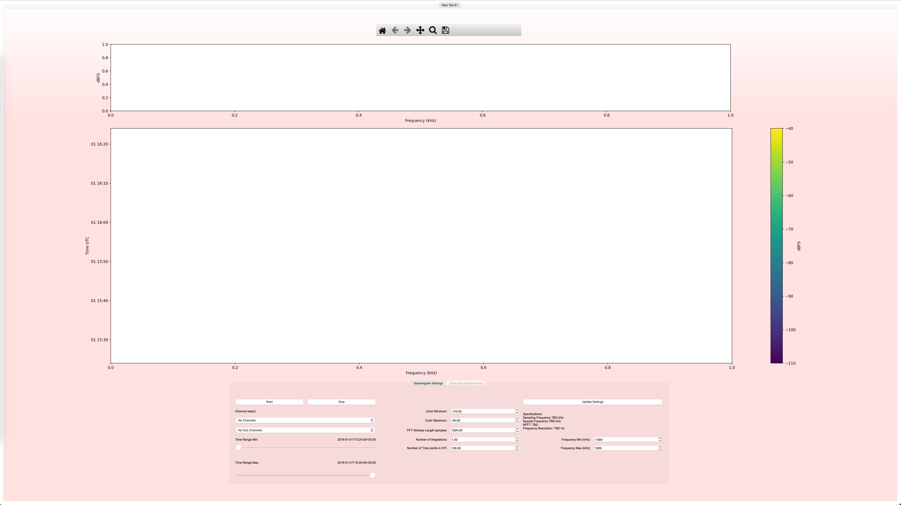
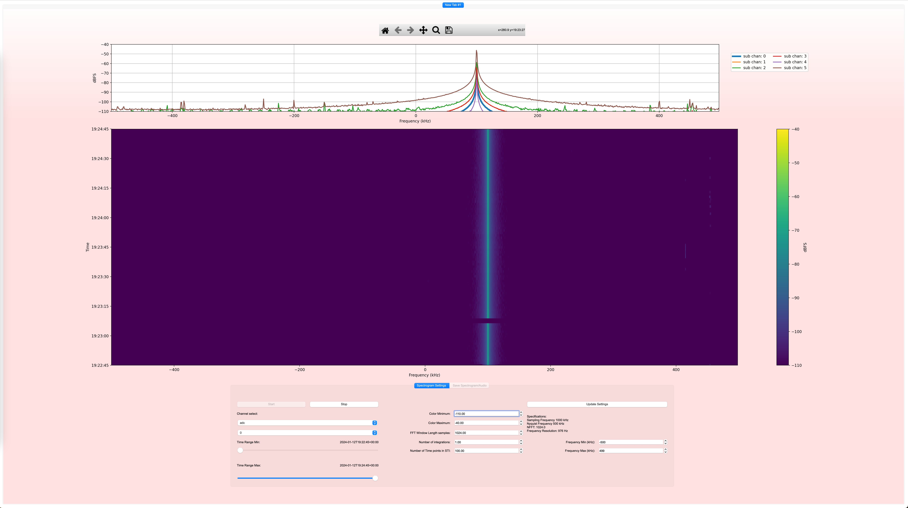
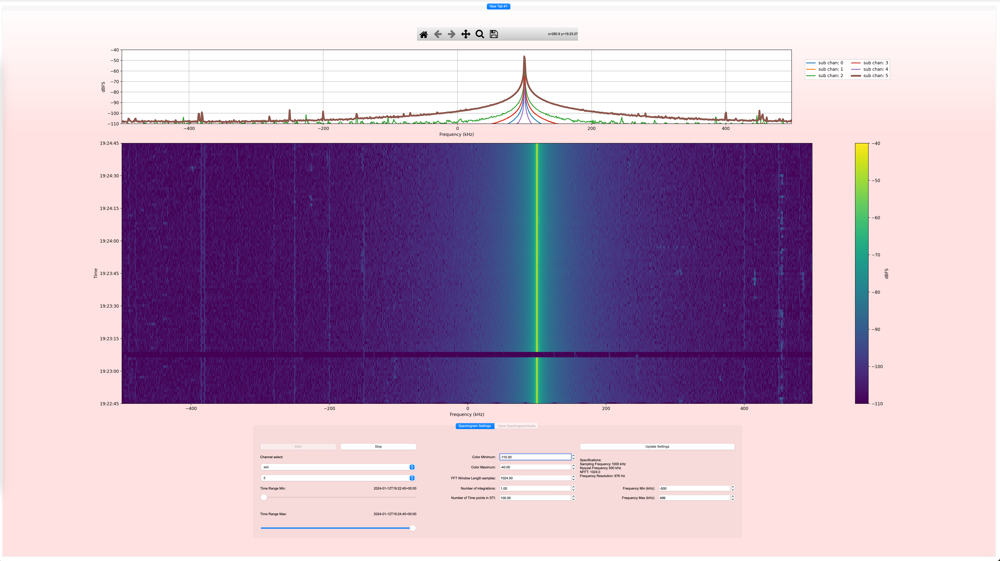

# DRF Spectrogram Viewer

Forked from [pyspectrogram](https://github.com/cdens/PySpectrogram)

## Overview

This is a pyqt 5 based gui for viewing PSDs and STI plots of [Digital RF](https://github.com/MITHaystack/digital_rf) data sets. The user can select the time over which the STI is plotted, the frequency coverage and number of samples in the FFT. The FFT always samples the full band the frequency windowing is simply windowing the plot of the FFT.

## How to Use

Once the drfview.py file is started the GUI will appear, across the whole screen. The user should press start then find a digital RF dataset. The gui will then plot the first channel and sub channel avalible. The currently selected channel will be highlighted in the PSD plot above. The time will increase on the STI from bottom to top. The user then can select the STI by first hitting the stop button followed by the save button, which then has controls to save out the STI. Note the text boxes controlling the color bar levels, fft samples, etc, should be interacted using the up and down arrows (see needed Improvements)

## Needed Improvements

* Fix issue with text boxes where the GUI refreshes and takes the value of the text box without user input
* Create a streaming mode.
* Save out PSD as well.
* Universal settings (e.g. GUI refresh rate)
* Advanced control over FFT parameters and filtering
* Filtering to remove unwanted signals from the audio (high/low-pass filtering, regenerating audio from a subset of the spectrogram)

